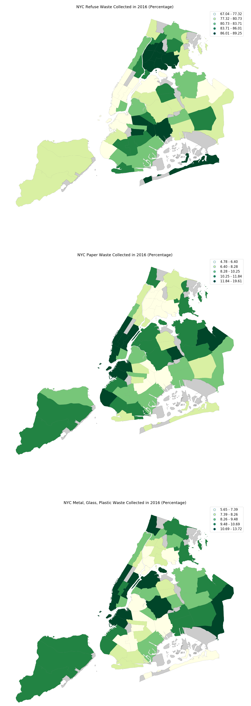

# HW8_uc288 - Visualization

## Department of Sanitation Tonnage Data

Above shows three maps of New York City separated by Community District blocks with the colors depicting the percentage of waste collected in 2016. It is separated into Refuse Waste, Paper Waste and Metal-Glass-Plastic (MGP) Waste. The amount was classified using a quantile scheme break.

To calculate for the percentage, the amount of waste collected per category was divided by the total amount of waste collected for the community district.

It is interesting to see that compared to the rest of the city, Lower Manhattan has a relatively lower percentage of refuse waste and a higher percentage of paper and MGP waste.
